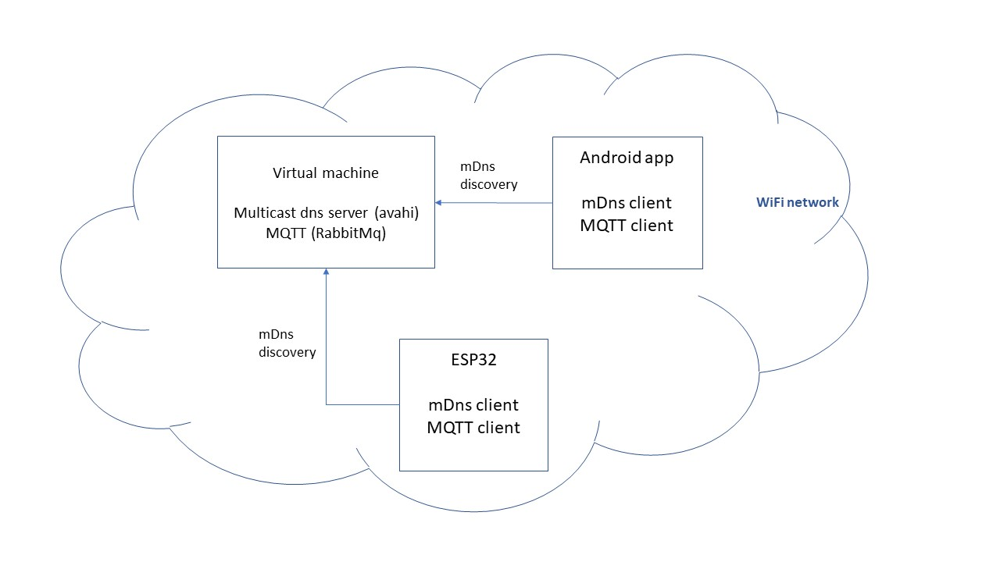

# Gofore hagaton 2019

ESP32 firmware and android application, which both resolve virtual machines IP using mDns, then exchange data via MQTT messagebroker. All three components must run in same subnet, like so:

## MQTT / mDns server

cd server \
vagrant up

Note. Vagrantbox is configured with virtualbox settings and uses bridged network adapter, which makes it quite unsecure.

## Android client

Made with kotlin. Note that app most likely doesn't properly work with emulator as it might not see mDns broadcasts.

## ESP32 firmware

Remember to set WiFi SSID and password before flashing the firmware.
